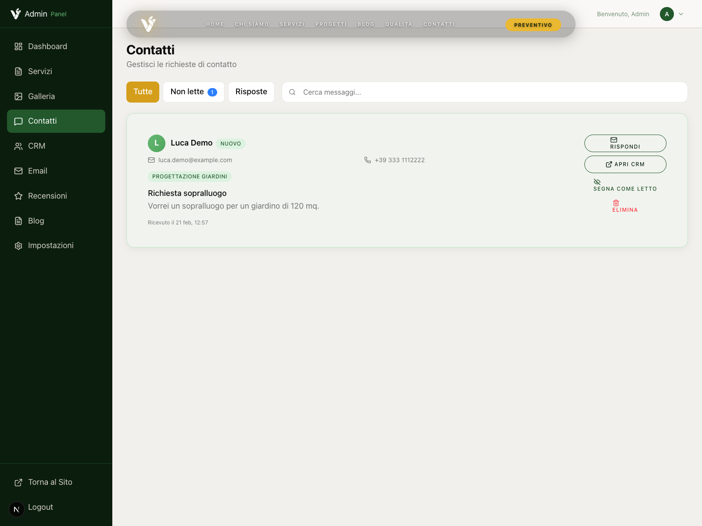
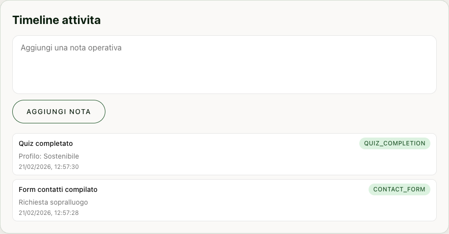
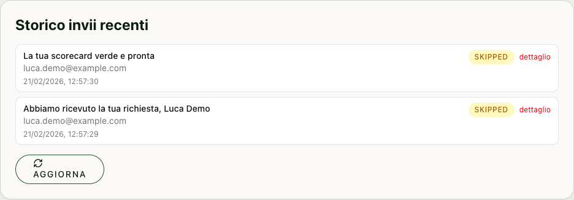

# Guida Operativa: CRM + Email Transazionali

Questa guida descrive le nuove funzioni introdotte nel pannello admin per:
- notifiche automatiche da form e quiz
- gestione contatti in un CRM basilare
- gestione template email centralizzati
- invio email one-shot dalla scheda cliente

## 1) Excursus delle nuove funzioni

### Cosa e stato aggiunto
- **Trigger automatici backend** su `contacts.submit` e `leads.submit`.
- **Invio email transazionali** (admin + cliente) con template dinamici.
- **Storico invii email** con stato (`queued`, `sent`, `failed`, `skipped`).
- **CRM base**: contatto unificato per email, timeline attivita, note, stato, tag.
- **Email builder in admin** con rich editor HTML, anteprima e invio test.
- **Invio one-shot da CRM** per contattare singoli lead/clienti.

### Nuove aree admin
- `/admin/crm`
- `/admin/emails`

### Viste principali

#### Dashboard (contatori CRM + Email)

#### Contatti (con shortcut "Apri CRM")

#### CRM: scheda cliente + invio email

#### CRM: timeline attivita

#### Email: template list + editor

#### Email: storico invii

## 2) Come funziona (flusso end-to-end)

1. Utente compila **form contatti** o **quiz + lead form**.
2. Il backend salva il record (`contactSubmissions` / `leads`).
3. Parte un job schedulato che:
   - fa upsert del contatto CRM (`crmContacts`)
   - aggiunge attivita in timeline (`crmActivities`)
   - invia email transazionali con template (`emailTemplates`)
   - registra consegna su `emailDeliveries`
4. In admin puoi:
   - aprire la scheda cliente
   - aggiungere note/stati/tag
   - inviare email one-shot
   - usare template e invio test

## 3) Setup rapido (obbligatorio)

Configura su Convex:
- `RESEND_API_KEY`
- `EMAIL_FROM`
- `ADMIN_NOTIFICATION_EMAIL` (anche multipla, separata da virgole)
- `ADMIN_PASSWORD_HASH` (gia richiesto per login admin)
- `SITE_URL` (opzionale ma consigliato)

Nota: se `RESEND_API_KEY` o `EMAIL_FROM` mancano, le email vengono tracciate come `skipped` (non inviate).

## 4) Utilizzo operativo

## 4.1 Gestione template email

Vai su **Admin > Email** (`/admin/emails`):
1. Scegli un template esistente o crea `Nuovo template`.
2. Compila:
   - `key` (univoca)
   - `name`
   - `category` (`transactional`, `newsletter`, `custom`)
   - `subject`
   - `body HTML` (rich editor)
3. Salva con `Salva template`.
4. Testa con:
   - `Variabili JSON`
   - `Email test`
   - `Invia test`

Template default di sistema vengono bootstrap automaticamente (contatto admin/cliente, quiz admin/cliente, one-shot standard, newsletter standard).

## 4.2 CRM cliente

Vai su **Admin > CRM** (`/admin/crm`):
1. Seleziona il contatto dalla colonna sinistra.
2. Aggiorna scheda:
   - nome/telefono
   - stato (`new`, `contacted`, `qualified`, `archived`)
   - tag
   - note cumulative
3. Salva con `Salva scheda`.
4. Aggiungi note rapide in `Timeline attivita`.

## 4.3 Invio email one-shot dal CRM

Nella scheda cliente:
1. Se vuoi usare un template, selezionalo in `Invia da template`.
2. In alternativa, compila `Subject one-shot` e body HTML nell'editor rich.
3. Clicca `Invia email one-shot`.
4. Verifica risultato in:
   - timeline CRM (attivita `email_sent`)
   - `Admin > Email > Storico invii recenti`

## 4.4 Dalla pagina Contatti al CRM

In **Admin > Contatti** trovi il pulsante `Apri CRM` su ogni richiesta.
Questo apre la scheda cliente corrispondente con filtro per email.

## 5) Tabelle dati introdotte

- `emailTemplates`
- `emailDeliveries`
- `crmContacts`
- `crmActivities`
- indice aggiuntivo su `contactSubmissions`: `by_email_date`

## 6) Troubleshooting rapido

- `skipped` nello storico invii:
  - controlla `RESEND_API_KEY` e `EMAIL_FROM`
- nessuna email admin:
  - controlla `ADMIN_NOTIFICATION_EMAIL`
- contatto non visibile in CRM:
  - verifica che form/quiz sia stato inviato e che i job schedulati siano partiti
- template non trovati:
  - esegui bootstrap default aprendo `/admin/emails` (lato UI viene chiamato `ensureDefaults`)

## 7) File di riferimento (codice)

- `convex/schema.ts`
- `convex/contacts.ts`
- `convex/leads.ts`
- `convex/crm.ts`
- `convex/emailTemplates.ts`
- `convex/emails.ts`
- `convex/emailDispatch.ts`
- `app/admin/crm/page.tsx`
- `app/admin/emails/page.tsx`
- `app/admin/components/RichHtmlEditor.tsx`

